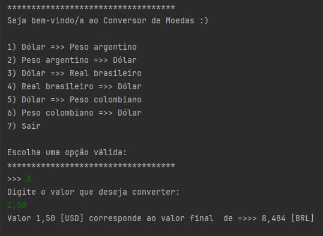

# 💻 Projeto Conversor de Moedas 💵

> Projeto desenvolvido como desafio para Alura

> O objetivo do projeto é criar um conversor de moedas ( que se conecte a uma API externa [ExchangeRate-API](https://www.exchangerate-api.com/) ) via CLI usando a liguagem Java.

## Acesso

O site pode ser acesso através do link:

[de-codificador-indol.vercel.app](https://de-codificador-indol.vercel.app/)

## Tecnologias e Ferramentas

  - Java
  - [IntelliJ IDEA](https://www.jetbrains.com/idea/)
  - [Gson](https://github.com/google/gson)

## ☕ Características

1. A aplicação permite que o usuário escolha uma lista de moedas para converter
2. Foi utilizado funcionalidades como Enum e Data Access Object (DTO)/Record com a finalidade de legibilidade, previsibilidade e Serialização/Deserialização.
3. Foi utlizada a biblioteca Gson para conversão entre estruturas de dados (JSON <=> Object).

## 📝 Licença

Esse projeto está sob licença. Veja o arquivo [LICENÇA]() para mais detalhes.
