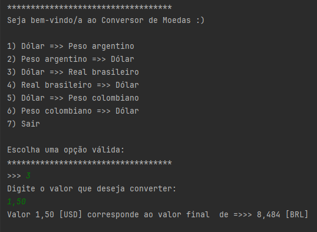
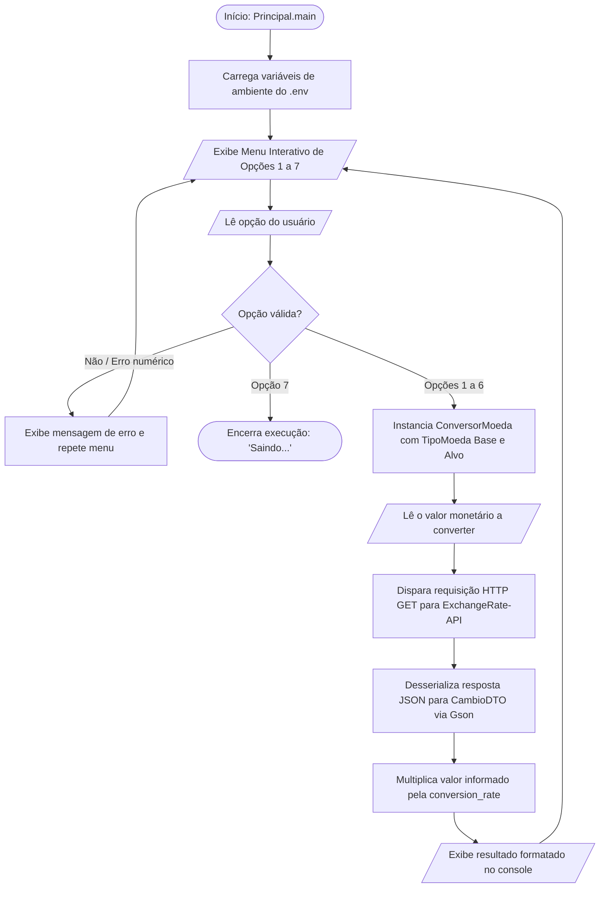

# 💱 Conversor de Moedas CLI — Java & ExchangeRate-API

<br />

<div align="center">
  
</div>

<br />

<div align="center">

[](https://www.oracle.com/java/)
[](https://www.exchangerate-api.com/)
[](https://github.com/google/gson)
[](https://github.com/cdimascio/dotenv-java)
[](https://www.alura.com.br/)
[](LICENSE)
[](#)

</div>

---

## 🔗 Acesso e Execução

Esta aplicação é executada como uma **ferramenta de linha de comando (CLI interativa)** no terminal local, conectando-se em tempo real aos servidores da **[ExchangeRate-API](https://www.exchangerate-api.com/)** para consultar dados cambiais dinâmicos.

---

## 📖 Visão Geral

O **Conversor de Moedas CLI** é uma aplicação desenvolvida como resolução prática do desafio de programação proposto no programa **ONE (Oracle Next Education)** em parceria com a **[Alura](https://www.alura.com.br/)**.

O objetivo primordial do projeto é construir um cliente HTTP robusto em **Java puro** capaz de consumir uma API externa RESTful, realizar a desserialização de payloads JSON em estruturas de dados fortemente tipadas e disponibilizar uma experiência interativa no console para conversão entre moedas internacionais com cotações financeiras em tempo real.

A aplicação estabelece a ponte cambial entre as principais moedas da América Latina (Real Brasileiro, Peso Argentino e Peso Colombiano) e a moeda de referência global (Dólar Americano).

---

## ✨ Funcionalidades

* **Menu Interativo no Terminal:** Interface textual estruturada em loop (`do...while`) com navegação guiada por opções numéricas.
* **Conversões Cambiais Bidirecionais:**
  1. 🇺🇸 Dólar Americano (`USD`) ➔ 🇦🇷 Peso Argentino (`ARS`)
  2. 🇦🇷 Peso Argentino (`ARS`) ➔ 🇺🇸 Dólar Americano (`USD`)
  3. 🇺🇸 Dólar Americano (`USD`) ➔ 🇧🇷 Real Brasileiro (`BRL`)
  4. 🇧🇷 Real Brasileiro (`BRL`) ➔ 🇺🇸 Dólar Americano (`USD`)
  5. 🇺🇸 Dólar Americano (`USD`) ➔ 🇨🇴 Peso Colombiano (`COP`)
  6. 🇨🇴 Peso Colombiano (`COP`) ➔ 🇺🇸 Dólar Americano (`USD`)
* **Taxas de Câmbio em Tempo Real:** Consulta dinâmica ao endpoint `/pair/{base}/{target}` da ExchangeRate-API a cada solicitação.
* **Cálculo Preciso com Casas Decimais Personalizadas:** Apresentação clara do montante original e do valor final convertido formatado em 3 casas decimais (`%.3f`).
* **Tratamento Resiliente de Entradas:** Captura e tratamento defensivo de exceções de digitação de valores não numéricos (`NumberFormatException`).
* **Encerramento Limpo:** Opção dedicada de encerramento seguro (`Opção 7 - Sair`).

---

## 🎯 Diferenciais e Destaques Técnicos

1. **Java Records para Imutabilidade (DTO Pattern):** A classe `CambioDTO` foi implementada utilizando o recurso moderno de **Records** do Java, garantindo imutabilidade dos dados de resposta da API (`base_code`, `target_code`, `conversion_rate`), código conciso sem boilerplate e integração direta com o mecanismo de reflexão do Gson.
2. **Tipagem Forte com Java Enums (`TipoMoeda`):** Centralização dos códigos padronizados ISO 4217 (`USD`, `ARS`, `BRL`, `COP`) dentro de um Enum dedicado, eliminando o uso de *magic strings* e prevenindo erros de digitação em parâmetros de requisição.
3. **Cliente HTTP Moderno e Nativo (`java.net.http.HttpClient`):** Emprego da API padrão introduzida no Java 11 (`HttpClient`, `HttpRequest`, `HttpResponse`), dispensando dependências externas pesadas como Apache HttpComponents ou OkHttp.
4. **Isolamento de Segredos com Dotenv:** Proteção da chave de acesso à API (`API_KEY`) através da biblioteca `dotenv-java`, carregando variáveis a partir do arquivo `.env` (ignorado no `.gitignore`), garantindo conformidade com as diretrizes do *Twelve-Factor App*.
5. **Serialização e Desserialização com Google Gson:** Integração da biblioteca [Gson](https://github.com/google/gson) para conversão instantânea do corpo JSON retornado pela API em objeto de transferência de dados (DTO).

---

## 🏗️ Arquitetura e Estrutura de Pastas

```bash
Conversor_Moedas_CLI/
├── .env.example                               # Modelo de configuração de variáveis de ambiente
├── .gitignore                                 # Regras de exclusão do Git (.env, bin, out, etc.)
├── ConversorDeMoedas.iml                      # Metadados de configuração do módulo IntelliJ IDEA
├── README.md                                  # Documentação técnica e guia do projeto
├── Snapshot.PNG                               # Evidência visual da aplicação em execução
├── .idea/                                     # Diretório de configurações da IDE
│   ├── inspectionProfiles/Project_Default.xml # Perfil de inspeção de código
│   ├── misc.xml                               # Configurações de versão do JDK (Java 21)
│   ├── modules.xml                            # Mapeamento de módulos do projeto
│   ├── uiDesigner.xml                         # Configurações de formulários da IDE
│   └── vcs.xml                                # Integração com controle de versão Git
└── src/
    ├── ConversorMoeda.java                    # Classe responsável pela requisição HTTP e cálculo
    ├── Principal.java                         # Ponto de entrada (Main), menu interativo e loop CLI
    ├── DTO/
    │   └── CambioDTO.java                     # Java Record (DTO) para mapeamento da resposta JSON
    ├── lib/
    │   └── dotenv-java-3.0.2.jar              # Dependência para carregamento do arquivo .env
    └── modelo/
        └── TipoMoeda.java                     # Enum com os códigos das moedas suportadas
```

---

## 🔄 Fluxo de Execução da Aplicação

O ciclo de vida da aplicação pode ser visualizado no fluxograma estrutural abaixo:


```mermaid
flowchart TD
    A([Início: Principal.main]) --> B[Carrega variáveis de ambiente do .env]
    B --> C[/Exibe Menu Interativo de Opções 1 a 7/]
    C --> D[/Lê opção do usuário/]
    D --> E{Opção válida?}
    E -- Não / Erro numérico --> F[Exibe mensagem de erro e repete menu]
    F --> C
    E -- Opção 7 --> G([Encerra execução: 'Saindo...'])
    E -- Opções 1 a 6 --> H[Instancia ConversorMoeda com TipoMoeda Base e Alvo]
    H --> I[/Lê o valor monetário a converter/]
    I --> J[Dispara requisição HTTP GET para ExchangeRate-API]
    J --> K[Desserializa resposta JSON para CambioDTO via Gson]
    K --> L[Multiplica valor informado pela conversion_rate]
    L --> M[/Exibe resultado formatado no console/]
    M --> C
```

---

## 🌐 Consumo de API Externa e Auditoria de Segurança

A aplicação comunica-se diretamente com o serviço **ExchangeRate-API** na versão 6:

```http
GET https://v6.exchangerate-api.com/v6/{API_KEY}/pair/{MOEDA_BASE}/{MOEDA_ALVO}
```

### Tratamento de Erros e Exceções de Rede
* As exceções de conectividade de rede (`IOException`) e interrupção de thread (`InterruptedException`) disparadas pelo `HttpClient.send()` são capturadas dentro de blocos `try/catch` no método `obterCambio()` e encapsuladas em `RuntimeException(e)`, evitando travamento silencioso do console.
* Erros de digitação de texto no lugar de números inteiros no menu são capturados com `try/catch (NumberFormatException e)`, notificando o operador e mantendo a sessão do menu ativa.

### Auditoria de Segurança e Boas Práticas

* **✅ Pontos Positivos:**
  * **Isolamento de Credenciais:** O token de autenticação (`API_KEY`) nunca é embutido no código fonte (*hardcoded*). Ele é injetado via `.env`, mantido fora do repositório por regras de exclusão no `.gitignore`.
  * **Modelo de Configuração Público:** O arquivo `.env.example` fornece a chave vazia como instrução limpa para novos desenvolvedores.
* **⚠️ Riscos Identificados e Plano de Mitigação:**
  * *Risco:* Ausência de verificação explícita de código de status HTTP (ex: 401 Unauthorized por chave inválida ou 429 Too Many Requests por esgotamento de cota).
    * *Mitigação Sugerida:* Avaliar `response.statusCode() == 200` antes da etapa de *parsing* com o Gson, exibindo mensagens amigáveis caso a chave esteja expirada.
  * *Risco:* Chamada bloqueante sem especificação de *timeout* explícito no cliente HTTP.
    * *Mitigação Sugerida:* Configurar `HttpClient.newBuilder().connectTimeout(Duration.ofSeconds(10)).build()` para mitigar travamentos em conexões instáveis.

---

## 📸 Demonstração da Aplicação

Abaixo está registrada a execução real do conversor no terminal:

<div align="center">
  
</div>

---

## 🎓 Objetivo do Projeto

Este projeto consolida os ensinamentos da trilha de **Java Orientado a Objetos** do programa **Oracle Next Education (ONE) + Alura**, exercitando:
* Comunicação cliente-servidor através do protocolo HTTP.
* Manipulação e consumo de Web APIs RESTful em Java.
* Trabalho com bibliotecas externas no ecossistema Java (Google Gson e Dotenv).
* Aplicação prática de recursos do Java 14+ (Records) e Java 17/21 (Text Blocks e novo HttpClient).

---

## ⚙️ Requisitos e Instalação

### Pré-requisitos
* **Java Development Kit (JDK):** Versão 17 LTS ou 21 instalada na máquina.
* **Chave de API Gratuita:** Obtenha uma chave gratuita em [ExchangeRate-API](https://www.exchangerate-api.com/).
* **Bibliotecas JAR:**
  * `dotenv-java-3.0.2.jar` (incluso na pasta `src/lib/`).
  * `gson-2.11.0.jar` (disponível para download no [Maven Central / GitHub](https://github.com/google/gson)).

### Configuração do Ambiente

1. Clone o repositório:
```bash
git clone https://github.com/erickystn/Conversor_Moedas_CLI.git
```

2. Acesse a pasta do projeto:
```bash
cd Conversor_Moedas_CLI
```

3. Configure o arquivo de variáveis de ambiente:
Copie o modelo de exemplo e insira a sua chave pessoal:
```bash
cp .env.example .env
```
Edite o arquivo `.env`:
```env
API_KEY=sua_chave_aqui
```

---

## 🚀 Como Executar

### Opção 1: Executando no IntelliJ IDEA (Recomendado)
1. Abra a pasta do projeto no **IntelliJ IDEA**.
2. Certifique-se de que o **Project SDK** esteja configurado para JDK 17 ou JDK 21 em `File > Project Structure > Project`.
3. Garanta que os arquivos `.jar` de `src/lib/` e o `gson-2.11.0.jar` estejam adicionados como bibliotecas do módulo (`File > Project Structure > Modules > Dependencies`).
4. Execute a classe `src/Principal.java` clicando no botão **Run** (`Shift + F10`).

### Opção 2: Executando via Terminal

1. Crie um diretório de saída para os arquivos compilados:
```bash
mkdir -p out
```

2. Compile os arquivos fonte incluindo as bibliotecas no classpath:
```bash
javac -cp "src/lib/*" -d out src/modelo/*.java src/DTO/*.java src/*.java
```

3. Execute a classe principal a partir da raiz do projeto (onde o `.env` está localizado):
```bash
java -cp "out:src/lib/*" Principal
```
*(No Windows, substitua `:` por `;` no parâmetro `-cp`)*

---

## 💻 Exemplos de Uso e Código

### 1. DTO de Câmbio com Java Record (`src/DTO/CambioDTO.java`)
```java
package DTO;

public record CambioDTO(String base_code,
                        String target_code,
                        double conversion_rate) {
}
```

---

### 2. Requisição HTTP e Desserialização com Gson (`src/ConversorMoeda.java`)
```java
private double obterCambio() {
    Dotenv dotenv = Dotenv.load();
    try {
        HttpClient client = HttpClient.newHttpClient();
        HttpRequest request = HttpRequest.newBuilder()
                .uri(URI.create("https://v6.exchangerate-api.com/v6/" + dotenv.get("API_KEY") 
                        + "/pair/" + moedaBase.getCodigo() + "/" + moedaAlvo.getCodigo()))
                .build();
        HttpResponse<String> response = client
                .send(request, HttpResponse.BodyHandlers.ofString());

        return new Gson().fromJson(response.body(), CambioDTO.class).conversion_rate();

    } catch (IOException | InterruptedException e) {
        throw new RuntimeException(e);
    }
}
```

---

### 3. Simulação de Execução no Terminal

```text
***********************************
Seja bem-vindo/a ao Conversor de Moedas :)

1) Dólar =>> Peso argentino
2) Peso argentino =>> Dólar
3) Dólar =>> Real brasileiro
4) Real brasileiro =>> Dólar
5) Dólar =>> Peso colombiano
6) Peso colombiano =>> Dólar
7) Sair

Escolha uma opção válida:
***********************************
>>> 3
Digite o valor que deseja converter: 
100

Valor 100,00 [USD] corresponde ao valor final de =>>> 545,820 [BRL]
```

---

## 🧪 Suíte de Testes

A validação do projeto foi conduzida por meio de **testes de mesa interativos e checagens manuais**, validando:
1. **Entradas Válidas:** Teste com valores inteiros e decimais fracionados.
2. **Entradas Inválidas no Menu:** Digitação de letras, caracteres especiais e números fora da faixa de 1 a 7.
3. **Persistência das Cotações:** Verificação da coerência das taxas retornadas pela API em relação aos valores oficiais de mercado do dia.

---

## 🛠️ Tecnologias Utilizadas

| Tecnologia | Versão / Papel | Descrição |
| :--- | :--- | :--- |
| **[Java](https://www.oracle.com/java/)** | 21 / 17 LTS | Linguagem de programação principal utilizada no desenvolvimento da lógica de negócio. |
| **[java.net.http](https://docs.oracle.com/en/java/javase/21/docs/api/java.net.http/java/net/http/package-summary.html)** | Nativo JDK | Cliente HTTP moderno para execução de chamadas REST síncronas. |
| **[Google Gson](https://github.com/google/gson)** | 2.11.0 | Biblioteca para conversão do JSON retornado pela API no Record `CambioDTO`. |
| **[Dotenv Java](https://github.com/cdimascio/dotenv-java)** | 3.0.2 | Gerenciamento seguro de variáveis de ambiente e leitura do arquivo `.env`. |
| **[ExchangeRate-API](https://www.exchangerate-api.com/)** | v6 REST API | Serviço web externo fornecedor de cotações de moedas em tempo real. |
| **[IntelliJ IDEA](https://www.jetbrains.com/idea/)** | IDE | Ambiente de desenvolvimento integrado utilizado para codificação e testes. |

---

## 📈 Melhorias e Próximos Passos (Roadmap)

- [ ] **Migração para Gerenciador de Dependências (Maven ou Gradle):** Eliminar arquivos `.jar` manuais no repositório, configurando um `pom.xml` ou `build.gradle`.
- [ ] **Histórico de Conversões:** Armazenar as últimas conversões do usuário em um arquivo local `.json` ou log com carimbo de data/hora (Timestamp).
- [ ] **Suporte a Novas Moedas:** Expandir o enum `TipoMoeda` para incluir Euro (`EUR`), Libra Esterlina (`GBP`), Iene Japonês (`JPY`) e Dólar Canadense (`CAD`).
- [ ] **Testes Automatizados com Mocks:** Criar testes unitários com JUnit 5 e Mockito, simulando as respostas da ExchangeRate-API sem consumir requisições reais.
- [ ] **Tratamento Específico de Status HTTP:** Implementar mensagens orientadas a códigos 401 (Chave Inválida), 404 (Moeda não suportada) e 429 (Limite excedido).

---

## 🤝 Como Contribuir

1. Realize um **Fork** do repositório.
2. Crie uma nova branch com a sua modificação:
   ```bash
   git checkout -b feature/suporte-euro
   ```
3. Realize seus commits semânticos:
   ```bash
   git commit -m "feat: adiciona suporte a conversao de Euro (EUR)"
   ```
4. Envie suas alterações para o seu repositório remoto:
   ```bash
   git push origin feature/suporte-euro
   ```
5. Abra um **Pull Request** explicando detalhadamente as mudanças.

---

## 👤 Autor & Créditos

* **Desenvolvedor:** [Ericky Sant'ana](https://github.com/erickystn)
* **Formação e Desafio:** Projeto proposto pela [Alura](https://www.alura.com.br/) no programa **Oracle Next Education (ONE)**.
* **Provedor de Dados:** [ExchangeRate-API](https://www.exchangerate-api.com/)

---

## 📄 Licença

Este projeto está licenciado sob a licença **MIT**. Para maiores detalhes, consulte o arquivo de licença ou utilize o código livremente para estudos e referências.
